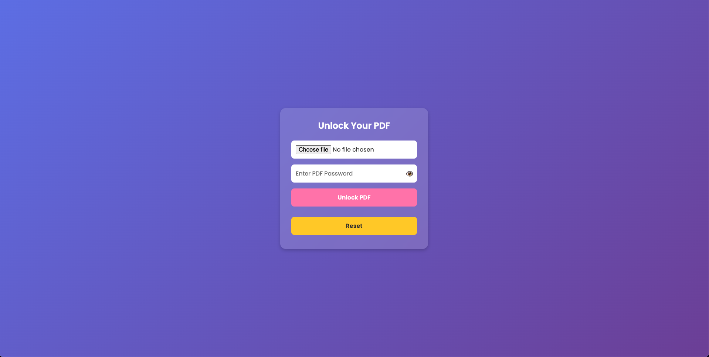

# 🚀 Free PDF Unlocker

A simple web-based PDF Unlocker that allows users to upload a password-protected PDF, enter the password, and download the unlocked version. This project uses **Flask** for the backend and **Nginx** for serving the frontend, all containerized with **Docker & Docker Compose**.

## 🛠 Features
- Upload a **locked PDF**
- Enter **password** to unlock it
- **Preview the unlocked PDF** before downloading
- **Reset button** to clear inputs
- **Dockerized** for easy deployment

---

## 📦 Installation & Setup

### 1️⃣ **Clone the Repository**
```sh
git clone https://github.com/pnrt/PDF-unlocker.git
cd PDF-unlocker
```

### 2️⃣ **Build & Run with Docker Compose**
```sh
docker-compose up --build
```
🚀 The application will be available at **http://localhost:8080**

### 3️⃣ **Access the API & Frontend**
- **Frontend (User Interface):** `http://localhost:8080`
- **Backend API (Flask):** `http://localhost:5000/unlock`

---

## 📌 Project Structure
```
/pdf-unlocker
│── /backend          # Python Flask Backend
│   ├── server.py
│   ├── requirements.txt
│   ├── Dockerfile
│── /frontend         # HTML+JS Frontend
│   ├── index.html
│   ├── nginx.conf
│   ├── Dockerfile
│── docker-compose.yml
│── README.md
```

---

## 🔧 Usage
1. **Upload** a password-protected PDF
2. **Enter the password**
3. Click **Unlock & Preview**
4. **Download the unlocked PDF**
5. Click **Reset** to start over

---

## 🐳 Docker Images
You can use pre-built Docker images from Docker Hub:

- **Backend Image:** [pnrt/pdf-unlocker-backend](https://hub.docker.com/r/pnrt/pdf-unlocker-backend)
- **Frontend Image:** [pnrt/pdf-unlocker-frontend](https://hub.docker.com/r/pnrt/pdf-unlocker-frontend)

Run the following to pull and start the containers:
```yml
version: '3'
services:
  backend:
    image: pnrt/pdf-unlocker-backend:0.1
    ports:
      - "5000:5000"
    restart: always

  frontend:
    image: pnrt/pdf-unlocker-frontend:0.1
    ports:
      - "8080:80"
    depends_on:
      - backend
    restart: always
```
```sh
docker-compose up -d
```

---

## 🛠 Troubleshooting

### 🔹 "502 Bad Gateway" Error
Make sure Flask is running correctly. Restart everything:
```sh
docker-compose down
docker-compose up --build
```

### 🔹 Large File Upload Issues
If you see `413 Request Entity Too Large`, increase the upload size in `nginx.conf`:
```nginx
client_max_body_size 20M;
```

---

## 📜 License
This project is open-source and available under the **MIT License**.

---

## 💡 Contributions
Feel free to **fork** this project, create a **pull request**, or **open an issue** for suggestions!

🔗 **GitHub Repository:** [PNRT](https://github.com/pnrt/PDF-unlocker)

